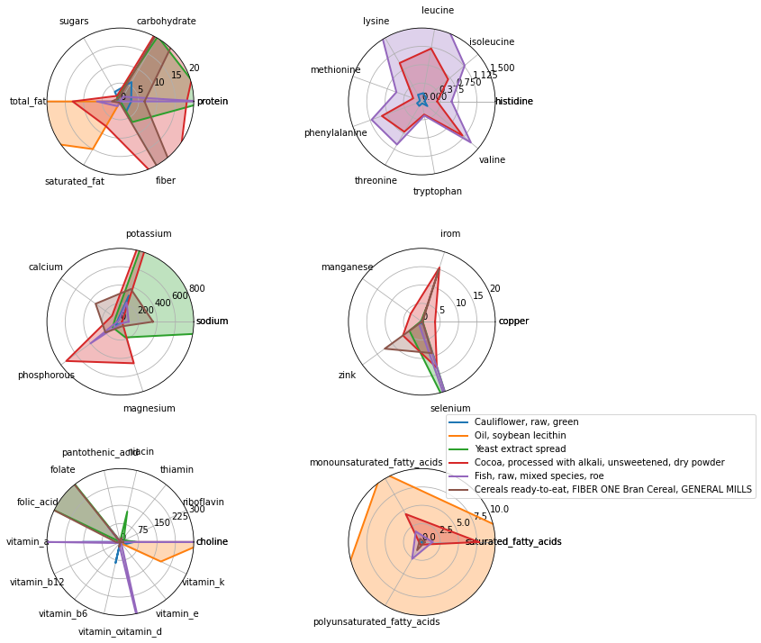

# Convex Nutrition Optimization

Anecdotally, I've often heard that one can survive on a diet of purely potatoes and milk. Dubious, I decided to find out for myself. In considering the above, I became interested in the more general questions: given a set of nutritional constraints, how can one construct an optimal diet? And, can we identify 'superfoods' that tend to appear in optimal diets?  

## Dataset
To answer these questions, we first need a dataset of foods and their nutritional properties. I found such a dataset on [kaggle](https://www.kaggle.com/datasets/trolukovich/nutritional-values-for-common-foods-and-products), originally sourced [here](https://www.nutritionvalue.org/). It contains 8789 foods and 75 nutritional features per 100g, including summary features (calories, protein, fat, carbohydrates, etc.), vitamins, minerals, amino acids, and fatty acids. To clean the dataset I removed a few useless columns (e.g. trans fat) and foods unlikely to realistically make up an adult's sdiet (e.g. babyfood, beverages, leavening agents). I noticed a significant fraction of foods were missing the full amino acid breakdown of their protein content; rather than fill these columns with, for example, the median value, I left these set to zero. In practice, I found the choice didn't significantly affect optimal diet results[^1].

## Constraints
Secondly, we need to establish the set of nutritional constraints. We can of course set whatever constraints we want but to get the 'healthiest' ones is harder than it sounds since nutrition is a controversial topic and scientifically the field is underdeveloped; specific nutritional requirements for individuals are a bit of a grey area[^2]. I used the US daily recommended allowances (male) as lower limits for most nutritional features and the European food safety authority tolerable upper intake levels as upper limits for vitamins and minerals. Below is the full list of constraints. Not all nutritional features have constraints, and some only have a lower or upper limit. Unconstrained nutritional features are not listed below.
---
### Macros
50 < total_fat (g) < 120
10 < saturated_fat (g) < 25
70 < protein (g) < 100
130 < carbohydrate (g) < 400

### Vitamins
550 < choline (mg) < 2500
400 < folate (mcg) < 900
400 < folic_acid (mcg) < 900
16 < niacin (mg) < 30
5 < pantothenic_acid (mg) < 100
1.3 < riboflavin (mg) < 500
1.2 < thiamin (mg) < 200
3000 < vitamin_a (IU) < 8000
2.4 < vitamin_b12 (mcg) < 8
1.3 < vitamin_b6 (mg) < 4
90 < vitamin_c (mg) < 1000
600 < vitamin_d (IU) < 5000
15 < vitamin_e (mg) < 500
120 < vitamin_k (mcg) < 500
### Minerals
1500 < sodium (mg) < 3000
1300 < calcium (mg) < 2000
0.9 < copper (mg) < 7
8 < iron (mg) < 35
400 < magnesium (mg) < 500
2.3 < manganese (mg) < 7
700 < phosphorous (mg) < 3500
4700 < potassium (mg) < 7000
55 < selenium (mcg) < 300
11 < zinc (mg) < 35

### Amino Acids
0.287 < cystine (g) < inf
0.7 < histidine (g) < inf
1.4 < isoleucine (g) < inf
2.73 < leucine (g) < inf
2.1 < lysine (g) < inf
0.728 < methionine (g) < inf
0.875 < phenylalanine (g) < inf
1.05 < threonine (g) < inf
0.28 < tryptophan (g) < inf
0.875 < tyrosine (g) < inf
1.82 < valine (g) < inf

### Carbohydrates
38 < fiber (g) < 55
0 < sugars (g) < 40

### Fatty Acids
17 < polyunsaturated_fatty_acids (g) < 30

### Other
50 < cholesterol (mg) < 250
0 < alcohol (g) < 5
100 < water (g) < 2000
---
I disregarded constraints on calories and food weight for now since these will be included as part of the optimization objective. Healthy humans typically need 1950 < calories (kcal) < 2500 and eat 3 < weight (lbs) < 5 of food per day. 

## Optimization
Now we can start by considering the optimal diet. This can be formulated as a linear program (LP). In fact, this exact problem led John von Neumann to postulate the theory of duality for constrained optimization[^3]. In 1947, George Dantzig approached von Neumann at the RAND corporation with the problem of devising a diet that met a soldier's nutritional needs as cheaply as possible, writing down an LP. Von Neumann immediately said 'oh, that!', and proceeded to connect the problem to his minimax theorem for two person zero sum games, to Dantzig's amazement.

The LP formulation of the optimal diet problem is as follows. Let $x$ be the vector of food weights in the diet in units of 100g, the optimization variable to be found. The nutritional constraints on $x$ can be summarized as $l < Ax < u$, where $l$ is the vector of lower bounds, $u$ upper bounds, and $A$ the matrix of constrained nutritional features. We have the additional constraint that $x > 0$, since we can't un-eat foods. Of course, many diets $x$ can satisfy this set of linear nutrtional constraints so we need a criterion to decide which of these feasible diets is the best. We can do this by defining a cost function $c^Tx$ that assigns a 'cost' to each food in the diet. The optimal diet is then the one that minimizes the cost function while satisfying the nutritional constraints. But what should the 'cost' vector $c$ be? 

There are a few options. We could define $c$ as the literal cost, the price of each food. Solving the resulting LP would find the cheapest diet that satisifes the nutritional constraints. This is pretty interesting, but unfortunately our dataset doesn't come with food prices -- they also presumably vary widely depending on where you live. The feasible options are minimizing weight (most mass efficient nutritional diet), calories (lowest calorie nutrtional diet), or both. With the original objectives of this article in mind, to get the best of both worlds I'm going to tradeoff between both of these objectives; at the extreme ends of the tradeoff we get the optimal diets for each objective. The LP is then:
---
Minimize $c^T\mathbf{x} + \gamma\mathcal{1}^T\mathbf{x}$

subject to $l \leq A\mathbf{x} \leq u$
                $\mathbf{x} \geq 0$
---
where $c$ is the vector of calories per 100g, the ones vector $\mathcal{1}$ is the vector of weights in units of 100g, and $\gamma$ is the tradeoff variable. Interestingly, note that since $\mathbf{x} \geq 0$, the objective $\mathcal{1}^T\mathbf{x}$ is equivalent to the L1 norm $\|\mathbf{x}\|_1$, meaning the solution to the optimization problem will be sparse. The optimal diet will be composed of a few foods that are very efficient at satisfying the nutritional constraints.

Before solving the problem, I want to explain why I chose to include calories as part of the objective function. Minimizing food weight makes sense, you don't want the nutritional diet to be a chore to eat (imagine eating 3kg of raw spinach), but calories are usually considered a nutritional requriement and could be included as a constraint instead of an objective. The reason is **I am more interested in identifying specific foods that appear in many optimal diets rather than the diets themselves**. Lower calorie intakes (not too low) are associated with good health outcomes and longevity. By including calories as part of the objective, the optimal diets are incentivized to include more low calorie 'superfoods'. Foods in the optimal diet that are robust to changes in the tradeoff parameter $\gamma$ must be particularly low calorie and nutritionally dense.

## Results
I solve the LP above using [CVXPY](https://www.cvxpy.org/) for a sweep of $\gamma$ values between [1e-1,1e4]. Outside of this $\gamma$ range the optimal diet doesn't change meaningfully. The optimal tradeoff curve between calories and weight is shown below. 

And here is the optimal diet for $\gamma = 1$ with weight in units of 100g:

Total calories:  871.1281429945614 kcal
Total weight:  1113.0965300000835 g

Weight (100g)     Name
---
4.412183          Cauliflower, raw, green
1.453970          Watercress, raw
0.787405          Bamboo shoots, without salt, drained, boiled, cooked
0.657726          Chicken spread
0.588269          Cocoa, processed with alkali, unsweetened, dry powder
0.569966          Fish, raw, mixed species, roe
0.518734          Mushrooms, grilled, exposed to ultraviolet light, portabella
0.516959          Tofu, prepared with calcium sulfate, salted and fermented (fuyu)
0.506891          Cabbage, without salt, drained, boiled, cooked, chinese (pak-choi)
0.361921          Cereals ready-to-eat, FIBER ONE Bran Cereal, GENERAL MILLS
0.292224          Gelatin desserts, with aspartame, reduced calorie, dry mix
0.147996          Oil, soybean lecithin'
0.146714          Vitasoy USA Nasoya, Lite Silken Tofu
0.095675          Yeast extract spread
0.048087          Oil, wheat germ
0.023411          Mushrooms, raw, exposed to ultraviolet light, or crimini, italian, brown
0.002834          Desserts, unsweetened, tablets, rennin

### Superfoods
Count of how many times foods appear in optimal diets.

## Potatoes and Milk

To return to the original inspiration for this article, can a diet of solely potatoes and milk satisfy all of the nutritional constraints? The answer is emphatically ... 

[^1]: Amino acid nutritional requirements are often filled by dense complete protein sources like soy in both cases. 
[^2]: Particularly since digestive efficiency is very poorly understood, and varies widely between individuals. You could eat the 'optimal' nutritional diet on paper but only digest 70% of it, making it a suboptimal diet for you.
[^3]: "The Man from the Future: The Visionary Life of John von Neumann" Ananyo Bhattacharya 2021
